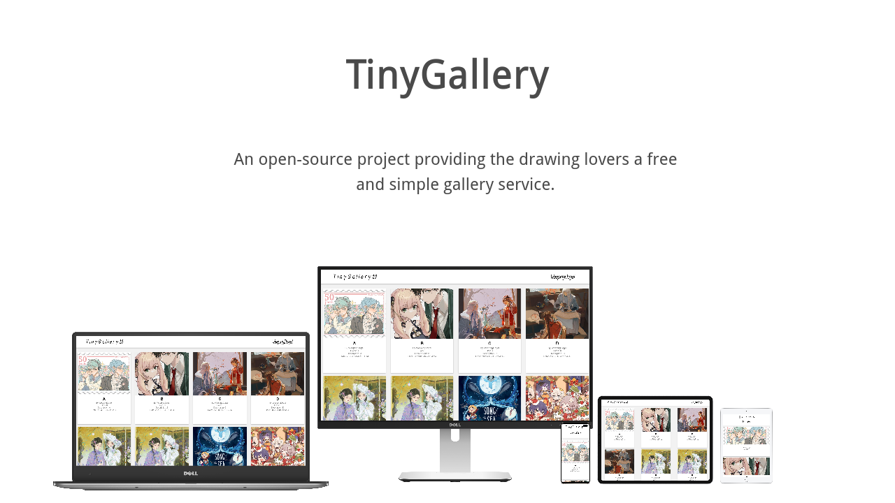

# Introduction

An open-source project providing the drawing lovers a free and simple gallery service.

**And this project is on the way!**

# Dependencies

* python3
* click==8.1.3
* Flask==2.2.2
* Jinja2==3.1.2
* MarkupSafe==2.1.1
* requests==2.28.1
* Werkzeug==2.2.2
* waitress==2.1.2


# Installation 

Download the source

```
wget https://github.com/WeepingDogel/tinygallery/archive/refs/tags/<version>.tar.gz
```

Unpack

```
tar xzvf tinygallery-<version>.tar.gz
```

Change to installation path.

```
cd [tinygallery-<version>]
```

Create Virutal Environment.

```
python -m venv venv
```

Active Virtual environment

```
. venv/bin/activate
```

Install Flask and waitress

```
pip3 install flask waitress
```

Initialization database

```
flask --app flaskr init-db
```

Start WSGI server

```
waitress-serve --host 127.0.0.1 --call flaskr:create_app
```

Proxy WSGI server with http server for example :nginx

* add some config to /etc/nginx/nginx.conf

```
server {
    listen 17779;
    listen [::]:17779;
    server_name TinyGallery;
        
    location / {
        proxy_pass http://127.0.0.1:8080/;
    }
}
```

* if you want to use the server as ipV6only:
```
server {
    listen 17779;
    listen [::]:17779 ipv6only=on;
    server_name TinyGallery;
        
    location / {
        proxy_pass http://127.0.0.1:8080/;
    }
}
```

Finally, start nginx

```
sudo systemctl start nginx
```

Enjoy~!